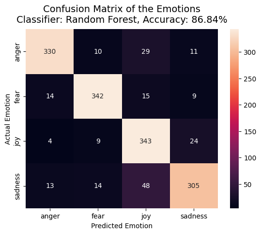
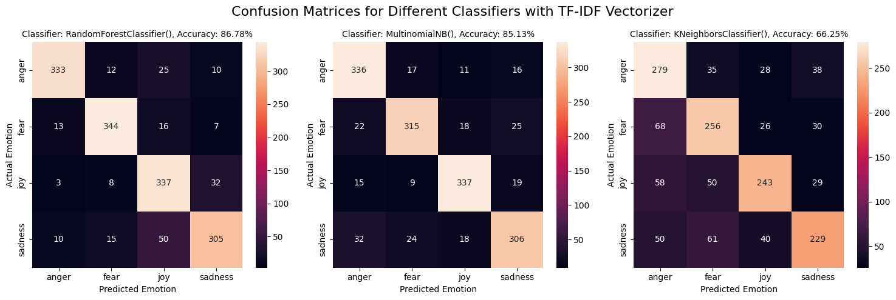
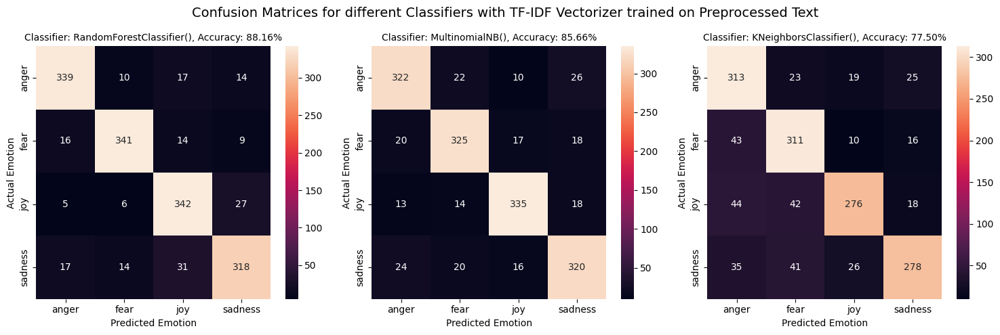
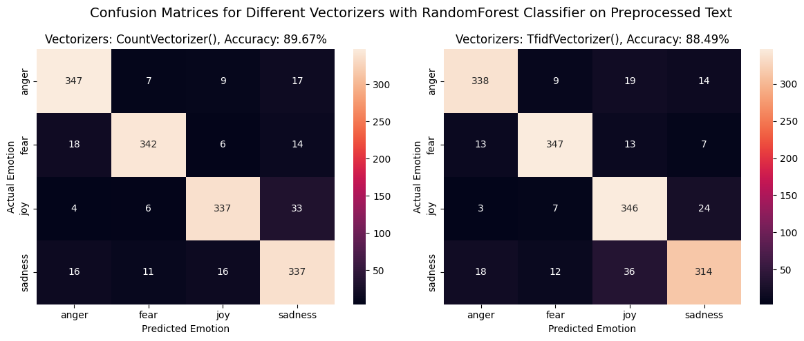
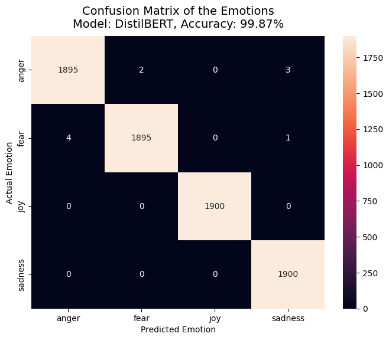

# NLP Emotion Classification: Classical ML & Deep Learning (Transformers)

This repository contains a comprehensive workflow for emotion classification in text using both classical machine learning algorithms and advanced deep learning models (transformers). The project demonstrates data preparation, feature engineering, model training, evaluation, and deployment as an interactive web app using Gradio.


https://github.com/user-attachments/assets/726c7aa2-40ad-4801-9730-ebfa49b83bac


## Table of Contents
- [Overview](#overview)
- [Dataset](#dataset)
- [Workflow](#workflow)
- [Results & Visualizations](#results--visualizations)
- [Gradio App Demo](#gradio-app-demo)
- [Deployment to Hugging Face Spaces](#deployment-to-hugging-face-spaces)
- [Requirements](#requirements)
- [How to Run](#how-to-run)
- [Try the Gradio App Online](#try-the-gradio-app-online)


## Overview

This project explores emotion classification using a dataset labeled with emotions such as **joy**, **sadness**, **anger**, and **fear**. The notebook covers:
- Data loading, exploration, and preprocessing
- Feature extraction (TF-IDF, Bag-of-Words)
- Model training and evaluation (Random Forest, Naive Bayes, KNN, DistilBERT)
- Visualization of results (confusion matrices)
- Interactive Gradio app for real-time emotion prediction
- Deployment instructions for Hugging Face Spaces

## Dataset

The dataset is sourced from [Kaggle: Emotions Dataset for NLP](https://www.kaggle.com/datasets/praveengovi/emotions-dataset-for-nlp) and contains text samples labeled with emotion categories.

## Workflow

1. **Data Preparation & Exploration**
   - Load and inspect data
   - Visualize class distribution
   - Address class imbalance
2. **Feature Engineering**
   - TF-IDF Vectorization
   - Bag-of-Words (CountVectorizer)
   - Text preprocessing with spaCy
3. **Classical Machine Learning Models**
   - Random Forest
   - Multinomial Naive Bayes
   - K-Nearest Neighbors
   - Evaluation with confusion matrices
4. **Deep Learning Approach**
   - Fine-tune DistilBERT transformer
   - Evaluation and comparison
5. **Gradio App**
   - Interactive web interface for emotion prediction
6. **Deployment**
   - Instructions for deploying the app to Hugging Face Spaces

## Results & Visualizations

### Confusion Matrices

#### 1. Random Forest with TF-IDF Vectorizer


#### 2. Comparing Classifiers (Random Forest, MultinomialNB, KNN) with TF-IDF (Non-Preprocessed Text)


#### 3. Comparing Classifiers (Random Forest, MultinomialNB, KNN) with TF-IDF (Preprocessed Text)



*Classifiers performed slightly better on preprocessed text. Random Forest achieved the best accuracy among classical models.*

#### 4. Comparing Vectorizers (CountVectorizer vs TF-IDF) with Random Forest (Preprocessed Text)


*CountVectorizer (Bag-of-Words) provided slightly better accuracy than TF-IDF.*

#### 5. DistilBERT Model (Deep Learning)


*DistilBERT outperformed all classical ML models.*


## Gradio App Demo

The notebook includes a Gradio app for real-time emotion prediction. Users can input text and receive predicted emotion probabilities instantly.

## Deployment to Hugging Face Spaces

Instructions are provided in the notebook for deploying the Gradio app as a web application using Hugging Face Spaces.

## Requirements
- Python 3.8+
- pandas, numpy, matplotlib, seaborn
- scikit-learn
- spaCy
- torch
- transformers
- datasets
- gradio

Install all dependencies with:
```bash
pip install -r requirements.txt
```

## How to Run

1. **Clone this repository:**
   ```bash
   git clone https://github.com/Pushtogithub23/NLP-Emotion-Classification-ML-DL-Gradio
   cd NLP-Emotion-Classification-ML-DL-Gradio
   ```
2. **Download the dataset from Kaggle** and place it in the `EMOTION DATASET` directory. (See notebook for details.)
3. **Install dependencies:**
   ```bash
   pip install -r requirements.txt
   ```
4. **Run the notebook:**
   Open `Emotion_Classification_Notebook.ipynb` in Jupyter or VS Code and execute the cells step by step.
5. **Launch the Gradio app:**
   Run the cell in section 6.1 to start the interactive web interface for emotion prediction directly in your notebook.
6. **Deploy to Hugging Face Spaces (optional):**
   - The notebook (section 6.2) provides detailed, step-by-step instructions for deploying your Gradio app to Hugging Face Spaces, including repository setup, model upload, and requirements configuration.
   - **Quick summary:**
     - Create a Hugging Face account and Space
     - Clone the Space repo
     - Add your `app.py`, requirements.txt, and model folder
     - Commit and push your files
     - Your app will be live at your Space URL


## Try the Gradio App Online

Test the deployed Gradio app instantly on Hugging Face Spaces:

👉 [Emotion Classifier Gradio Demo on Hugging Face Spaces](https://huggingface.co/spaces/PuspenduHF/gradio-emotion-classification-NLP)

**Author:** Puspendu Rana

**License:** MIT
